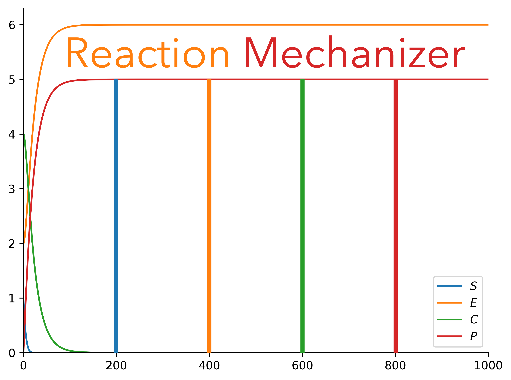
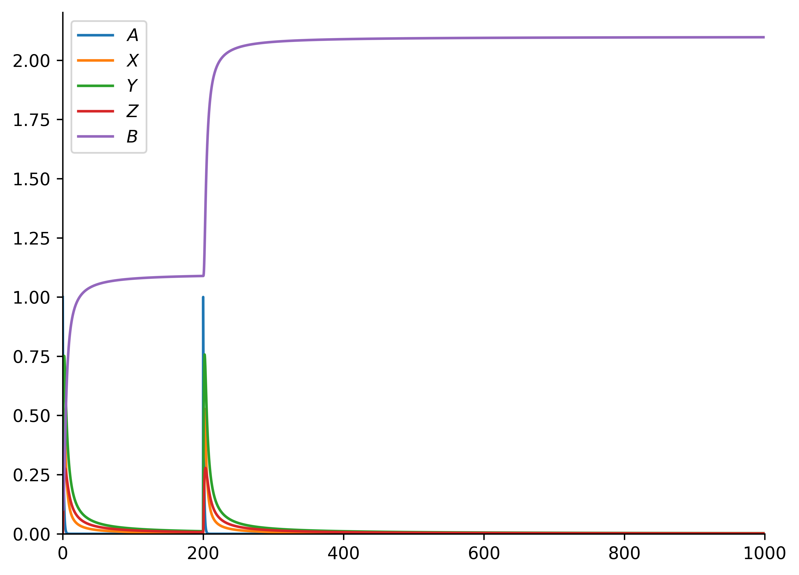
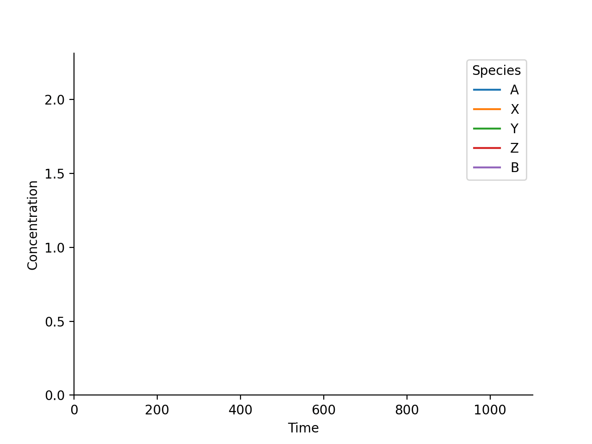

---
# Reaction Mechanizer


Reaction Mechanizer is a Python tool that can be used to simulate chemical reactions.

# Table of Contents
1. [Theory](#theory)
2. [Documentation](#documentation)
3. [Requirements](#requirements)
4. [Installation](#installation)
5. [Usage](#usage)
# Theory <a id="theory"></a>
The rates at which steps in a reaction occur are governed by differential equations. For example, consider the equilibrium step:

```A+B<--->C+D```

Without loss of generality, if we focus solely on species `C`, notice that the rate of production of `C` is jointly proportional to the concentrations of `A` and `B` (more likely for the forward reaction to go through as the amount of interactions increase). However, the rate is also dictated by the reverse reaction, which is proportional to the interactions between `C` and `D`. So, the overall rate law for `C` is:

```dC/dt=k1*A*B - k2*C*D```

A system of ODEs can be built for any step, and any full mechanism (a combination of steps).
# Documentation <a id="documentation"></a>
Compiled documentation for this whole package is hosted [here](https://armaanahmed22.github.io/ReactionMechanizer/).
# Requirements <a id="requirements"></a>
Reaction Mechanizer requires Python 3.8 in addition to the following libraries:
- matplotlib
- seaborn
- scipy
- pandas
- numpy

Specific version requirements are in `requirements.txt`
# Installation <a id="installation"></a>
The latest version can be manually installed from source.

```bash
git clone https://github.com/ArmaanAhmed22/ReactionMechanizer.git && cd ReactionMechanizer && pip install .
```

Or, the current release can be installed from PyPi:

```bash
pip install ReactionMechanizer
```

# Usage <a id="usage"></a>
Reaction Mechanizer can either simulate a `SimpleStep` or a `ReactionMechanism`. Either can be created from a string:

```python
from reaction_mechanizer.pathway.reaction import SimpleStep, ReactionMechanism

ss = SimpleStep.str_to_step("2A+1/2B->1/3C+D")
ss.set_rate_constant(kf=1,kr=0)

rm = ReactionMechanism.str_to_mechanism(
"""A->X+Y
X->Z
Z+Y->B"""
)
rm.set_rate_constants([{"kf":1}, {"kf": 0.5, "kr": 0.25}, {"kf":0.7}])
```

From an initial state, the step/mechanism progression can be seen using the `ReactionVisualizer` class as follows:

```python
from reaction_mechanizer.drawing.mechanism_reaction_visualizer import ReactionVisualizer, ReactionEvent
vis = ReactionVisualizer(rm)  #or ReactionVisualizer(ss)
progress_reaction_params = {
    "initial_state": {"A": 1, "X": 0, "Y": 0, "Z": 0, "B": 0.1},
    "time_end": 1000,
    "number_steps": 5000,
    "events": [(200, ReactionEvent.CHANGE_CONCENTRATION, ("A", 1))],
}
"""Arguments:
1) initial state of species
2) time
3) granularity (how many times to evaluate the differential equations to derive our answer)
4) [optional] any events (ie adding certain species) that occur in the middle of the reaction (here, at time=200, with an increase of concentration of 1 for "A")"""
dataframe = vis.progress_reaction(out = "out.png", **progress_reaction_params)
```

The following graph is generated:

Even a video output can be generated:

```python
vis.animate_progress_reaction(
    video_destination_no_extension="out",
    video_length=10,
    fps=60,
    extension="gif",
    **progress_reaction_params)
```

And, the following `gif` is generated!
